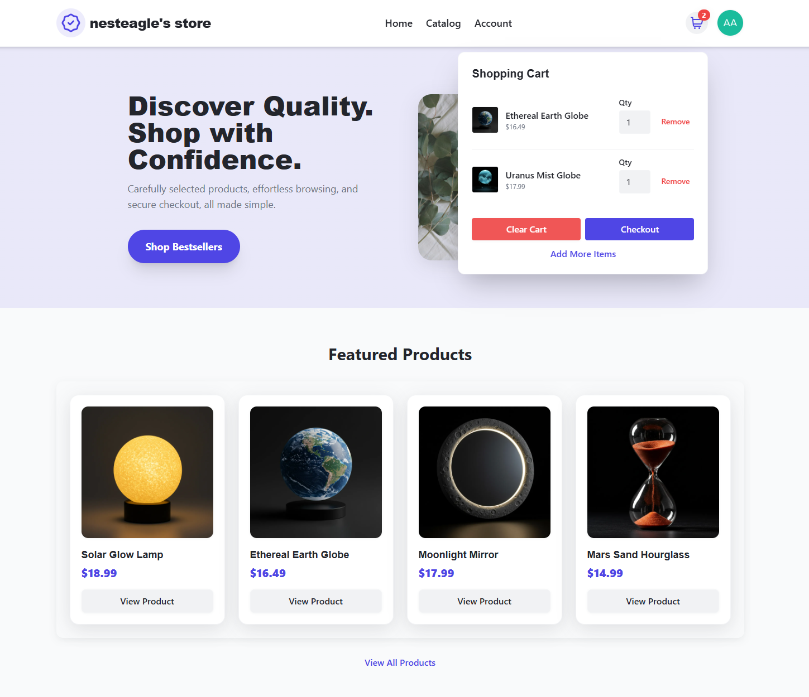
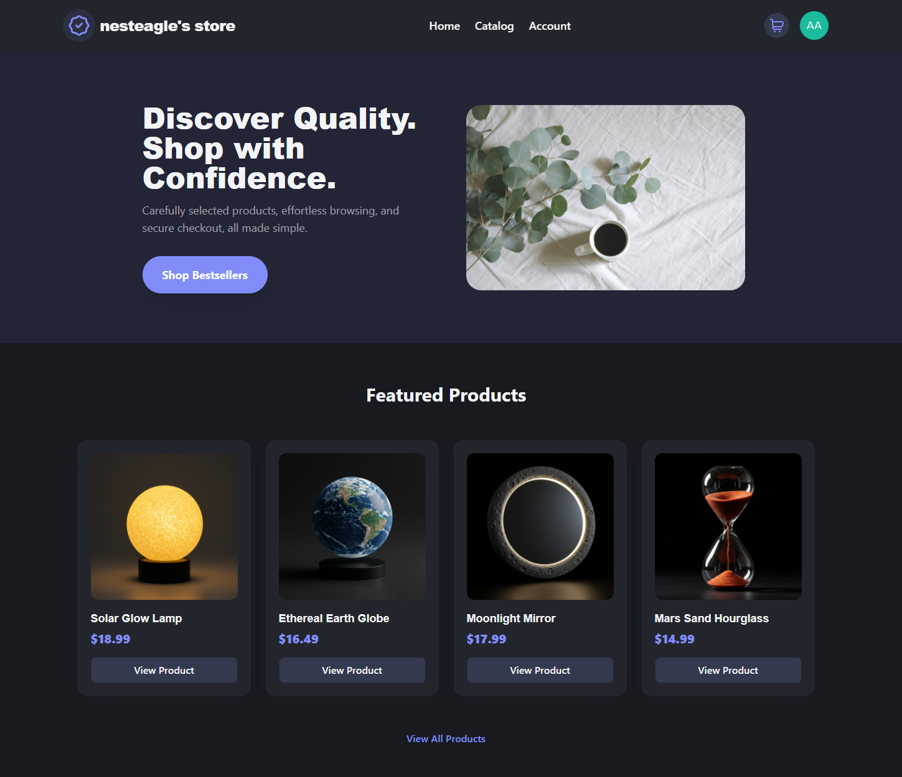
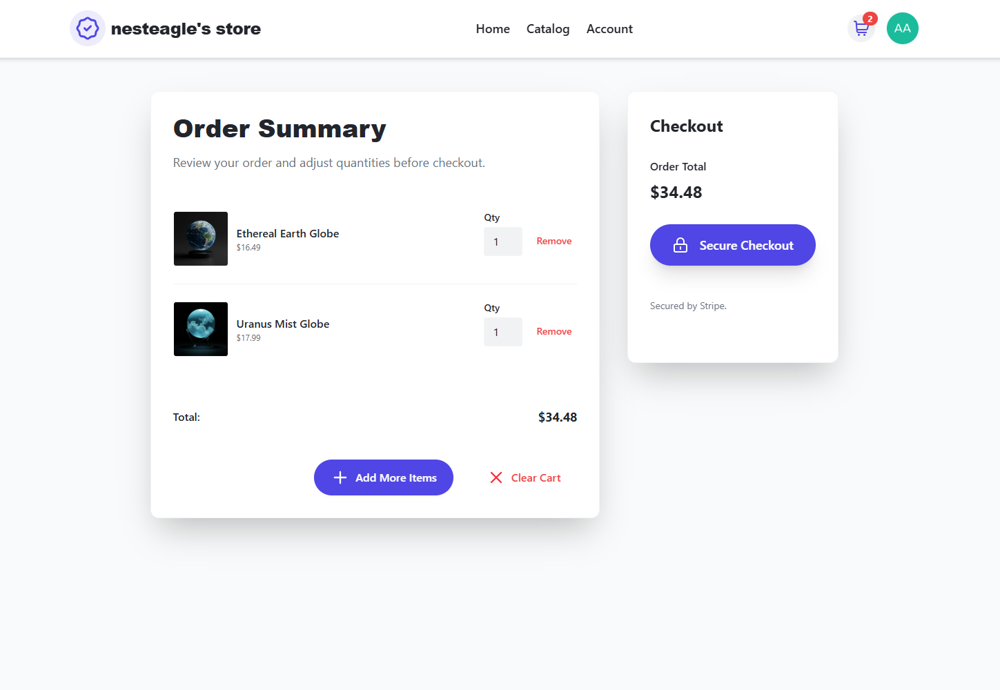
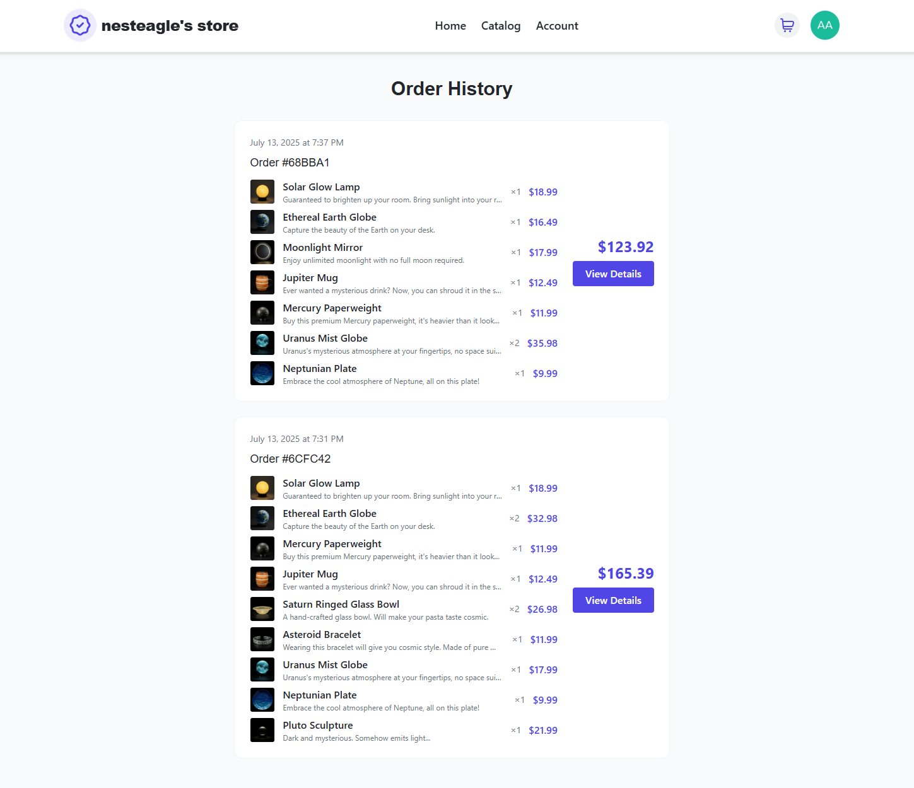
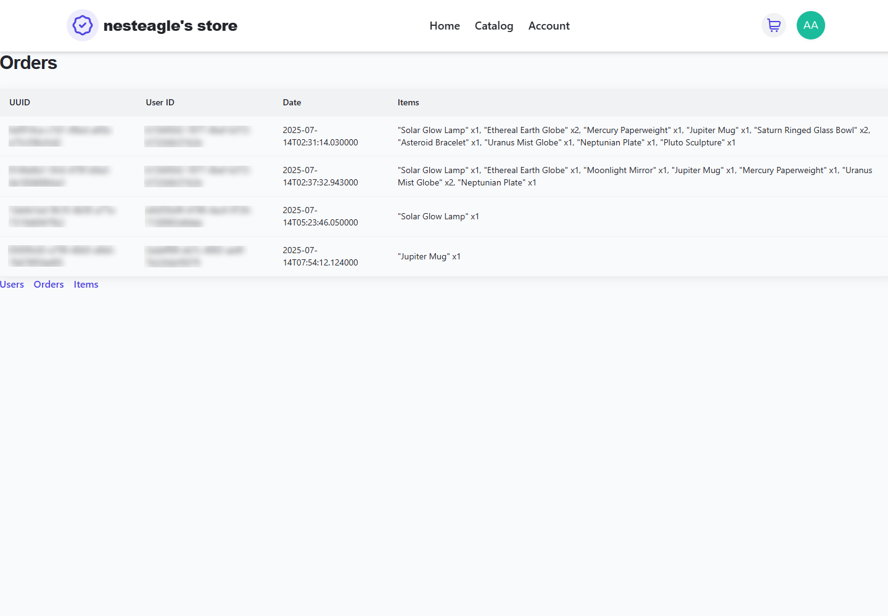

<div align="center">


# FastAPI Store Web App

[](https://fastapi.tiangolo.com/)
[](https://stripe.com/)
[](https://auth0.com/)
[](https://docker.com/)
[](https://azure.microsoft.com/)
[](https://reactjs.org/)
[](https://tailwindcss.com/)

**A modern full-stack e-commerce platform built with FastAPI, React, and Azure.**

</div>

---

## 📋 Table of Contents

- [Key Features](#-key-features)
- [Project Overview](#-project-overview)
- [Live Demo](#-live-demo)
- [Technology Stack](#-technology-stack)
- [Technical Achievements](#-technical-achievements)
- [Project Scope & Impact](#-project-scope--impact)
- [Learning Journey](#-learning-journey)
- [Frontend Highlights](#-frontend-highlights)
- [Admin Tools Overview](#-admin-tools-overview)

## ✨ Key Features
- 🔐 Secure Auth0 user and endpoint authentication
- 💳 Complete payment integration with webhooks
- 🎨 Mobile-first Tailwind CSS theming with custom @theme integration and dark mode
- ☁️ Containerized Azure deployment with multi-service architecture
- 🛢️ Complete DB integration using Azure SQL + SQLModel, with optimized queries and transaction consistency

## 📖 Project Overview

This was my summer project between first and second year at UBC Computer Science. Over 4 weeks (June 19 - July 13), I independently learned the skills from scratch, fully implemented this application, and deployed using Azure Cloud infrastructure.

## 🌐 Live Demo

> **Try it now:** Explore all the features here!

[Visit Live Application](https://frontend-app.graydune-f392eb79.westus2.azurecontainerapps.io)

For demonstration purposes, use these Stripe test card numbers:
```
Card Number: 4242 4242 4242 4242
Expiry: Any future date (e.g., 12/25)
CVC: Any 3 digits (e.g., 123)
```

*Note: Each Azure container may take 30 seconds to wake up, this keeps hosting costs minimal for a demo project like this.*

## ⚡ Technology Stack

### **Backend**
- **FastAPI** - Modern async framework with automatic OpenAPI documentation
- **Auth0-FastAPI** - JWT validation and endpoint protection
- **SQLModel** - Type-safe ORM with Pydantic integration
- **Stripe API** - Payment ecosystem with webhooks - can be switched to other payment gateways
- **Azure SQL Database** - Secure, cloud-hosted database 
- **Unit Testing** - Unit testing with Pytest for service layer

### **Frontend**
- **React** - Modern hooks and context patterns
- **Tailwind CSS** - Custom theming with @theme integration
- **Auth0 React SDK** - Authentication integration with token management
- **Vite** - Build tooling for development

### **DevOps & Production**
- **Docker** - Multi-container orchestration
- **Azure CLI** - Streamlined setup and config for cloud infrastructure
- **RESTful API Design** - Documented endpoints following OpenAPI specifications
- **Environment Management** - Secure configuration handling
- **Auth0** - RBAC and OAuth flows


## 🏗️ Technical Achievements

**Complex Systems Integration**
- Built a complete order fulfillment pipeline from cart → checkout → payment → database
- Implemented real-time Stripe webhook processing with DB transaction consistency
- Created type-safe API contracts shared between frontend and backend

**Production-Ready Architecture**
- Service layer pattern with dependency injection for testability
- Async FastAPI handling concurrent payment processing
- Complete RBAC implementation with role-based UI rendering and API access control
- Multi-service architecture with containerized microservices and horizontal scaling

**Modern Development Practices**
- End-to-end type safety from database models to React components
- Comprehensive error handling with user-friendly messages
- Container-first development with Docker multi-stage builds
- Complex cloud-native development and Azure deployment pipeline

**Performance & Security**
- Optimized database queries with SQLModel relationships and eager loading
- JWT-based authentication with automatic token refresh
- PCI-compliant payment handling through Stripe integration
- Automatic RBAC on user signup and API endpoint protection

## 📊 Project Scope & Impact

**Full-Stack E-commerce Platform**
- Complete user management system with role-based permissions
- End-to-end payment processing with webhook-driven order fulfillment  
- Responsive storefront with advanced theming and dark mode
- Production-ready Azure deployment with containerized microservices

**Development Achievement**
- **4-week intensive development** from first commit (June 19) to release (July 13)
- **Complete ownership** of architecture, design, implementation, testing, and deployment
- **Modern tech stack** following industry best practices for security and scalability

## 🎓 Learning Journey
This project represents my deep dive into modern web development during my first-year summer break. I started learning FastAPI in mid-June, with my first commit June 19, and deployed by July 13.

**What challenged me most:** 
- I accidentally implemented JWT decoding from scratch before discovering auth0-fastapi
- Deployment to Azure and learning modern deployment pipelines
- Ensuring webhook reliability and transaction consistency between Stripe and my database after deployment

## 💡 Frontend Highlights

- **Home Page** - Browse featured products here.

- **Catalog** - View all products and search by keyword.

- **Shopping Cart** - Add items into your shopping cart, either by each product's page or through catalog.

<div align="center">
  
</div>
<p align="center"><em>Home page with shopping cart open.</em></p>

- **Responsive Themes** - Click on your profile and toggle Dark Mode theme. Must be signed in to use.

<div align="center">
  
</div>
<p align="center"><em>Home page in Dark Mode.</em></p>

- **Checkout** - Sign in using email or Google OAuth, and check out your cart!

<div align="center">
  
</div>
<p align="center"><em>Checkout page.</em></p>

- **Order History** - Check your account history and view previous orders here.

<div align="center">
  
</div>
<p align="center"><em>Order history page. I went on a wild shopping spree!</em></p>


## 👑 Admin Tools Overview
- **View and Manage Items** – CRUD operations on store inventory.
- **View Users** – View non-sensitive user data: email, database ID, Auth0 ID.
- **View Orders** – View all order contents and timestamps.
<div align="center">
  
</div>

<p align="center">
  <em>Admin order view.</em>
</p>

---

<div align="center">

*⭐ If you liked this project, give it a star!*

</div>